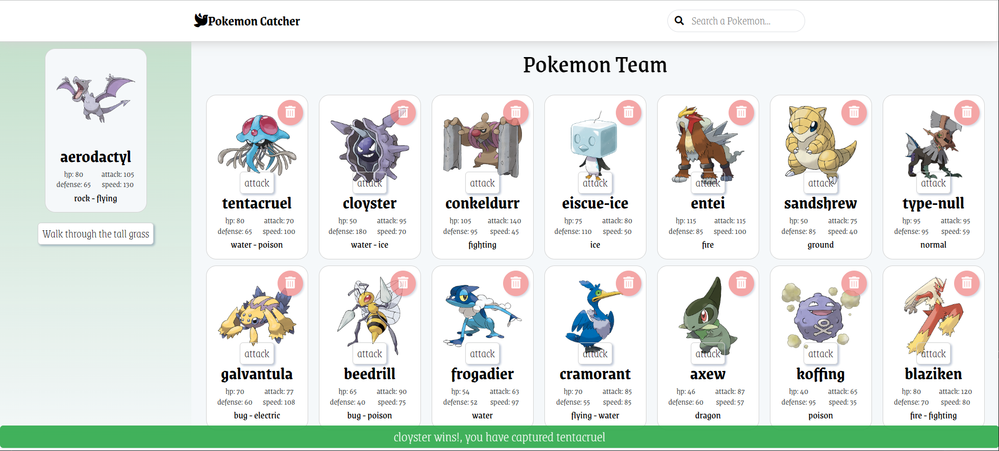
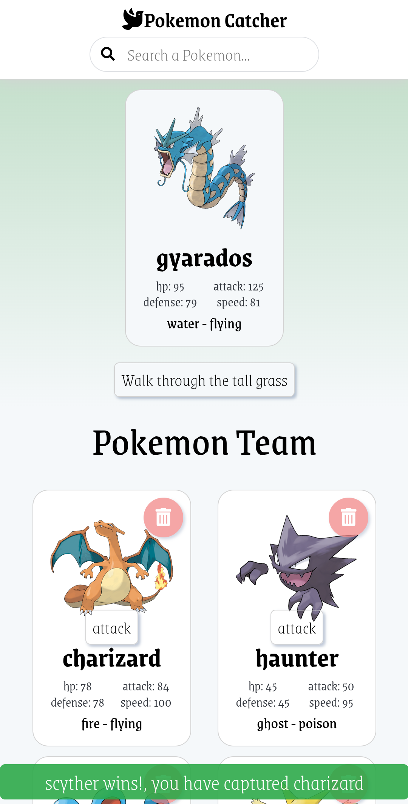

# Poke APP

Poke App is a responsive application created with React and TypeScript. The game starts giving you a random pokemon, you must use this pokemon to catch the pokemons you find through the tall grass. Each pokemon you catch will be added to your team, and you can use it to catch more pokemons.


Design patterns used:
- Compound Component
- Provider/Consumer
- Functional Component
- Hooks and Custom Hooks
- Prop Drilling
- Container and Presentational
- CSS in Js with Styled Components

Methodologies used:
- Atomic Design

Architectures used:
- Component-Based Architecture

## Screenshots

- Desktop



- Mobile



## Deployment

https://ourpokeapp.netlify.app/

## Settings

- Node version: 14.18.1
- Yarn version: 1.22.15

Install yarn via npm:

```
npm install --global yarn
```

Visual Studio Code Plugins: 

- ES7 React/Redux/GraphQL/React-Native snippets
- Typescript React code snippets
- styled-components-snippets
- vscode-styled-components

Git Flow:
```
https://danielkummer.github.io/git-flow-cheatsheet/
```

## How to start

Clone the repo:
```
https://github.com/stivenjsdev/PokeApp.git
```

Install dependencies:
```
yarn or yarn install
```

You can start the project and run server with the command:
```
yarn start or yarn run start
```

Open http://localhost:3000 to view it in the browser.

# Annotations

## Yarn

Starting a new project:
```
yarn init
```

Adding a dependency:
```
yarn add [package]
yarn add [package] --dev
yarn add [package]@[version]
```

Upgrading a dependency:
```
yarn upgrade [package]
yarn upgrade [package]@[version]
```

Removing a dependency:
```
yarn remove [package]
```

Install all the dependencies of project
```
yarn
```

## React with TypeScript

Local dev setups:
- Create React App:
```
npx create-react-app [app-name] --template typescript
```

## Styled Components

Installation:
```
yarn add styled-components
```

Types:
```
yarn add -D @types/styled-components
```
or
```
yarn add --dev @types/styled-components
```
